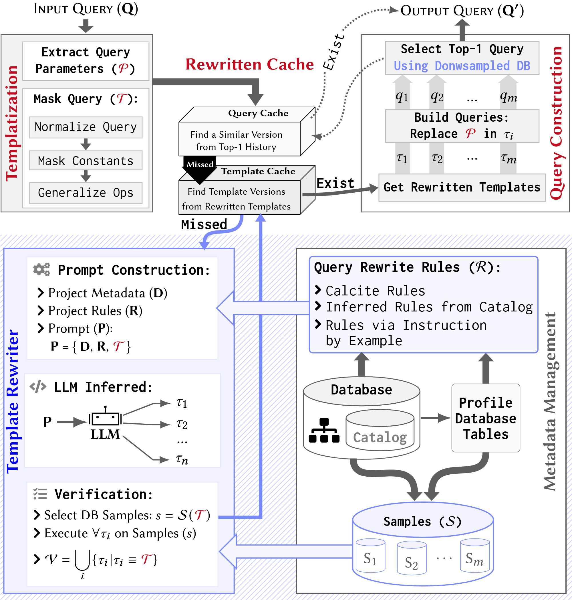

# ReSequel: Robust LLM-assisted Query Rewriting and Optimization using Templatization and Sampling

**Overview:** ReSequel is an outer optimization layer on top of existing DBMSs that rewrites SQL queries using large language models. We leverage catalog and statistical metadata to infer template-specific rewriting rules that guide the LLM toward effective query transformations. We generate, verify for correctness on sampled data, and rank rewritten query variants to ensure both result accuracy and runtime improvements. ReSequel yields workload-level speedups of up to 16× over native DBMSs and 22× over LLM-based systems, with individual queries exceeding 600×, across eight benchmarks (JOB, TPC-H, Stats, Stats-CEB, Public BI, IMDB, DSB, StackOverflow) and three DBMSs (PostgreSQL, MySQL, DuckDB).



This repository is a simplified version of the main  `ReSequel` repository, prepared for `VLDB 2026`. In the Project Structure section, we outline the contents of the repository. At the root level, there is a `src` folder containing the core implementation of `ReSequel`, and an `Experiments` folder with scripts for running `ReSequel` and the baselines.

We have also included the workloads used in the paper, all of which are open-source. Due to space limitations, we did not include the baseline code directly, but we provide links to their open repositories in the setup section.

A step-by-step guide for installation and execution is provided at the end.


## Project Structure

```
├── src/
│   ├── main/python/              # Core ReSequel implementation
│   │   ├── main.py               # Entry point
│   │   ├── catalog/              # Database catalog extraction
│   │   ├── Database/             # DBMS connection & query execution
│   │   ├── llm/                  # LLM integration (Gemini, Groq)
│   │   ├── prompt/               # Prompt templates & builder
│   │   ├── runquery/             # Query templatization
│   │   ├── verify/               # Correctness verification via sampling
│   │   └── util/                 # Config, logging, file I/O
│   ├── main/cpp/                 # Downsampling engine (C++17)
│   └── test/
│
└── Experiments/
    ├── catalog/                  # Pre-extracted DB metadata (JSON) for all benchmarks
    ├── workload/                 # SQL queries + schemas per benchmark x DBMS
    │   └── {PostgreSQL, MySQL, DuckDB}/
    │       ├── {benchmark}/          # Original queries
    │       └── {benchmark}-template/ # Templatized queries (extracted by ReSequel)
    ├── explocal/                 # Experiment scripts
    │   ├── exp1_ReSequel/        # ReSequel pipeline stage scripts
    │   └── exp2_Baselines/       # Baseline experiment scripts
    └── run*.sh                   # Top-level setup & execution scripts
```

**Hardware and Software Info:** We ran all experiments on a server node (VM) with an Intel Core CPU (32 vcores) and 150 GB of DDR4 RAM. The software stack consisted of Ubuntu 22.04, OpenJDK 11 (for Java baselines), PostgreSQL 17.1, MySQL 8, DuckDB, Python 3.10, and C++17.

**Setup and Experiments:** The repository is pre-populated with the paper's experimental results (`./results`). The entire experimental evaluation can be run via `./runAll.sh`, which deletes the results and performs setup, dataset download, data preparation, data generation, and local experiments. However, for a more controlled evaluation, we recommend running the individual steps separately as described below.

---

## Reproduce Guide

### Step 1: Install Dependencies
---
The `./run1SetupDependencies.sh` script installs all required dependencies:

* **JDK 11**: for Java-based baselines (LearnedRewrite, LLM-R2, R-Bot)
* **unzip**, **unrar**, and **xz-utils**: for decompressing datasets
* **Python 3.10**: for Python-based baselines
* **C++17**: for our downsampling system
* **PostgreSQL 17, MySQL 8, and DuckDB**: all host DBMSs

```bash
./run1SetupDependencies.sh
```

### Step 2: Configure LLM API Keys
---
ReSequel uses LLM services (Google Gemini and Groq) for query rewriting. Create API keys using the links below and set them in `APIKeys.yaml` before proceeding.

* **Google Gemini**: [https://aistudio.google.com/](https://aistudio.google.com/)
* **Groq (qwen-qwq-32b)**: [https://console.groq.com/](https://console.groq.com/)

```yaml
# Path: Experiments/setup/ReSequel/APIKeys.yaml

- llm_platform: Groq
  key_1: 'YOUR KEY'

- llm_platform: Google
  key_1: 'YOUR KEY'
```

### Step 3: Set Up Baselines
---
The `./run2SetupBaseLines.sh` script automatically compiles the Java and Python baseline implementations and sets up runnable apps in the `Setup` directory. There are three query rewriting baselines and one equivalence checking baseline used in our paper; we made minor modifications to each to integrate them into our evaluation pipeline:

* **LearnedRewrite**: [https://github.com/XuanheZhou/LearnedRewrite](https://github.com/XuanheZhou/LearnedRewrite)
* **LLM-R2**: [https://github.com/DAMO-NLP-SG/LLM-R2](https://github.com/DAMO-NLP-SG/LLM-R2)
* **R-Bot**: [https://github.com/curtis-sun/LLM4Rewrite](https://github.com/curtis-sun/LLM4Rewrite)
* **SQLSolver** *(query equivalence checker)*: [https://github.com/SJTU-IPADS/SQLSolver](https://github.com/SJTU-IPADS/SQLSolver)

```bash
./run2SetupBaseLines.sh
```

### Step 4: Download Datasets
---
The `./run3DownloadData.sh` script downloads all open-source datasets used in the paper:

* **TPC-H**: [https://github.com/gregrahn/tpch-kit](https://github.com/gregrahn/tpch-kit)
* **DSB**: [https://github.com/microsoft/dsb](https://github.com/microsoft/dsb)
* **IMDB**: [https://dataverse.harvard.edu/dataset.xhtml?persistentId=doi:10.7910/DVN/2QYZBT](https://dataverse.harvard.edu/dataset.xhtml?persistentId=doi:10.7910/DVN/2QYZBT)
* **Stats**: [https://github.com/rbergm/PostBOUND/tree/b731b03115862db6c994ad4be43312d47dfd421e](https://github.com/rbergm/PostBOUND/tree/b731b03115862db6c994ad4be43312d47dfd421e)
* **Stats-CEB**: [https://github.com/Nathaniel-Han/End-to-End-CardEst-Benchmark](https://github.com/Nathaniel-Han/End-to-End-CardEst-Benchmark)
* **StackOverflow**: [https://github.com/SQL-Storm/SQLStorm](https://github.com/SQL-Storm/SQLStorm)
* **Public BI Benchmark**: [https://github.com/cwida/public_bi_benchmark](https://github.com/cwida/public_bi_benchmark)

```bash
./run3DownloadData.sh
```

### Step 5: Generate and Load Data
---
Generate synthetic data for TPC-H and DSB, then load all datasets into the three DBMSs:

```bash
./run4GenerateData.sh                # Generate TPC-H and DSB data

./run5PrepareData-PostgreSQL.sh      # Create databases and import data into PostgreSQL
./run5PrepareData-MySQL.sh           # Create databases and import data into MySQL
./run5PrepareData-DuckDB.sh          # Create databases and import data into DuckDB
```

> **Note:** If a database already exists, it will be dropped and recreated.

### Step 6: Run ReSequel Experiments
---
Runs all ReSequel experiments five times and stores results in the `results` directory:

```bash
./run6LocalExperiments.sh
```

### Step 7: Run Baseline Experiments
---
Runs all baseline experiments and stores results in the `results` directory:

```bash
./run7LocalExperimentsBaselines.sh
```

### Quick Start: Run Everything
---
To run the full pipeline end to end:

```bash
./runAll.sh
```